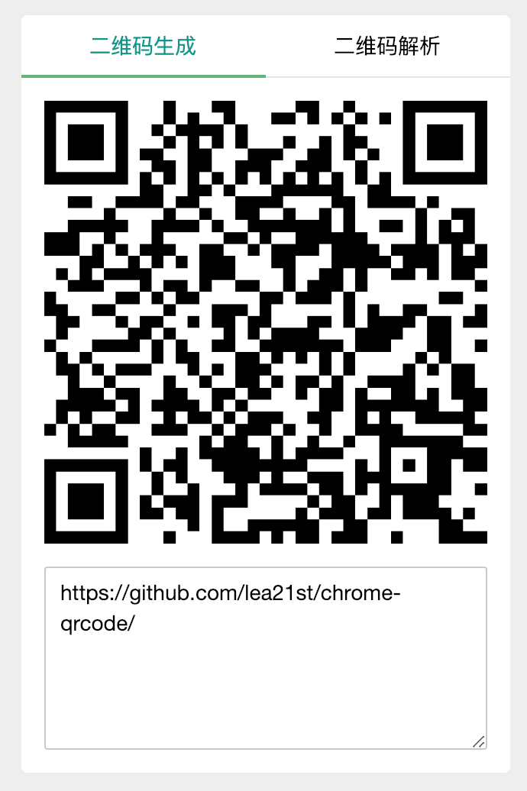
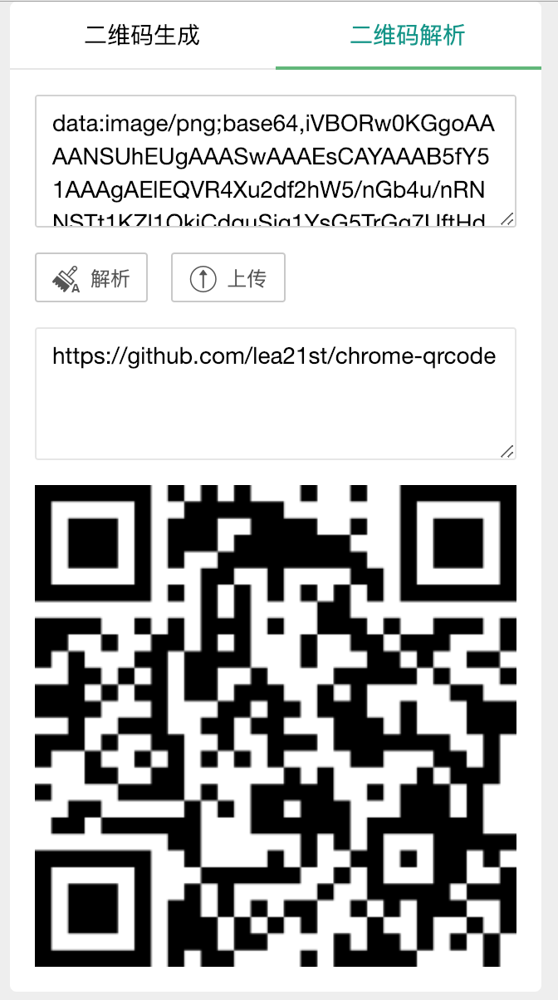

谷歌浏览器二维码生成和解析插件
===============
**暂时未上架谷歌应用商店，请手动在浏览器打包后安装；**

快捷键 Mac/Window: `Ctrl+Shift+D`

双击`textarea`快速复制

安装方法：下载上面代码中的`qrcode.crx`，打开浏览器到扩展程序页（浏览器输入`chrome://extensions/`即可快速打开），将该文件拖到页面即可完成安装

## **界面截图**

